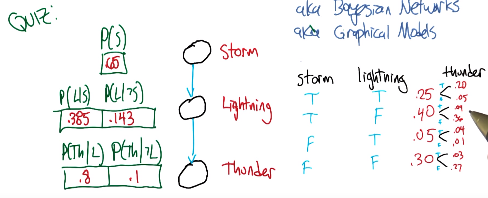
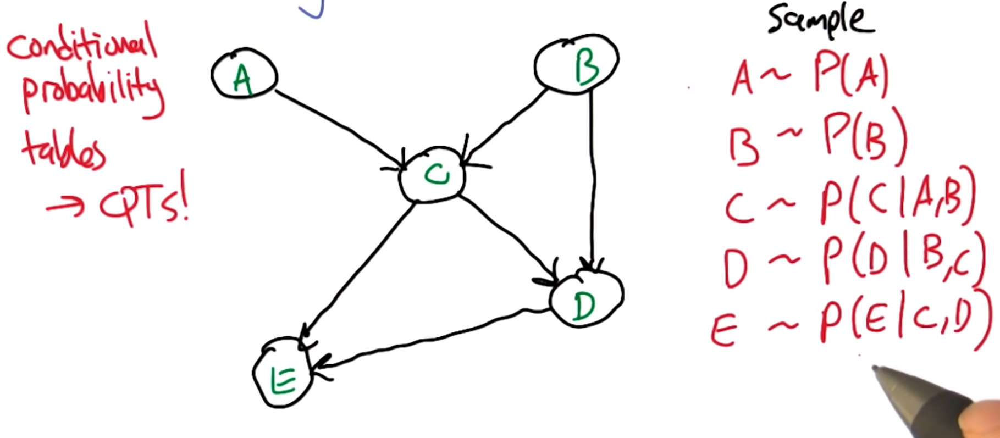
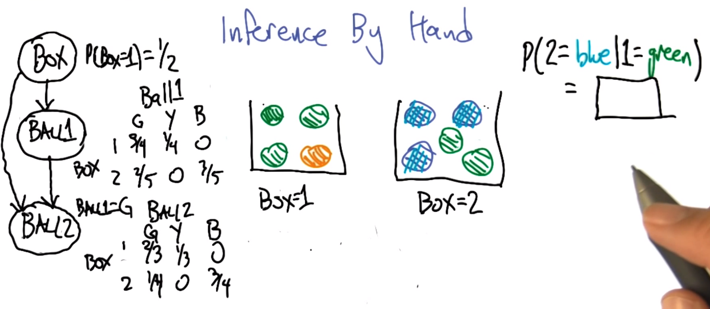

# Lesson 10: Bayesian Inference

## Joint distribution

If we have many attributes, the table to describe the probability of the each joint event will be very large. So instead of doing this, we are going to factor the attributes down.

## Conditional independence

**Definition**: $X$ is conditionally independent of $Y$ given $Z$ if the probability governing $X$ is independent of value of $Y$ given the value of $Z$; that is, if:
$$\forall x,y,z \quad P(X=x | Y=y, Z=z) = P(X=x|Z=z)$$

more compactly, we can write:
$$P(X|Y,Z) = P(X|Z)$$

Recall: normal independence gives  $P(X|Y) = P(X)$

## Belief Networks

a.k.a. Bayes Net, Bayesian Networks, Graphical Model

Represent the conditionally independent relationships between all the variables in the joint distribution graphically.

* nodes: variables
* edges: dependencies

Quiz Example:

Note that here thunder is conditionally independent of storm given lightning.

In Bayes Nets, the complexity of the table grows **exponentially** with the number of parent variables (**in-degree**).

## Sampling from the joint distribution

* We need to sample the dependencies first. So the sampling order should be **topological sort**.
* There cannot be cylic dependencies. The nets must be acylic.

## Recovering the joint distribution

In this graph, we can get:

$$P(E)=P(E|C,D)P(D|B,C)P(C|A,B)P(A)P(B)$$

Note that here we only need $3+3+3+1+1=11$ numbers to specify the whole distribution. In the contrary, if no conditional independencies, we need $2^5-1=31$ numbers to describe it.

## Sampling

Why sampling?

* two things the distributions are for:
  + probability of values
  + generate values
* simulation of complex processes
* approximate Inference (machine side)
  + exact: hard
  + approximate: faster
* visualization -- get a feeling (human side)

## Inference Rules

Marginalization

$$ P(X) = \sum_Y P(X,Y)$$

Chain Rule

$$ P(X,Y) = P(Y|X)P(X)$$

Bayes Rule

$$ P(Y|X)= \frac{P(X|Y)P(Y)}{P(X)}$$

Total Probability Theorem

$$ P(Y) = \sum_X P(Y|X)P(X)$$

**Example Inference**

$$\begin{aligned}
P(2=blue | 1=green) = & P(2=blue|Box=1, 1=green)P(Box=1|1=green)\\
+ &  P(2=blue|Box=2, 1=green)P(Box=2|1=green)
\end{aligned}$$

Notice we actually used Total Probability Theorem in the equation break-up. And $P(Box=2|1=green)$ needs Bayes to solve.

## Naive Bayes

Given a value (label, class) $v$ and a set of **independent attributes** $a_1,a_2,\dots ,a_n$ decided by the label. i.e. we know:

* $P(a_i|v)$
* $a_1,a_2,\dots ,a_n$ are independent

Then ($Z$ is a nomalization factor):

$$P(v|a_1,a_2,\dots ,a_n) = \prod_i P(a_i|v)P(v)/Z $$
$$v_{MAP} = argmax_v \;P(v)\prod_i P(a_i|v)$$

## Why Naive Bayes is cool?

Advantages

* Inference is cheap
* Few paramters
* Estimate the paramters with the labeled data.
  + We can easily estimate $P(a_i|v) = \frac{\#(a_i,v)}{\#(v)}$
* Connects the Inference with classification
* Empirically successful

Disadvantages

* No free lunch
* It doesn't model the inter-relationships between the attributes.
* One unseen attribute will spoil the whole bunch. **Overfitting** -- In the real world, the count is initialized with some value, so no count is zero. **Smoothing**. But this induce inductive bias that all attributes tend to be equally likely.

## Wrapping up

* Bayes Networks -- representation of joint probability
* Examples of using networks to compute probability
* Sampling -- a way to do approximate Inference
* Naive Bayes -- link to classification
